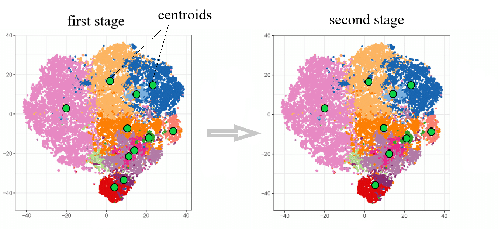

# kmeans_importantCluster
Seeded kmeans with important cluster

## Supervised data clustering
In this project, I aim to cluster labeled data using the K-Means algorithm, with a specific focus on initializing cluster centers based on class averages. The initial cluster centroids are set as the mean values of each class to ensure that the clusters are representative of the original classes.

After clustering, the predicted cluster labels are compared with the actual class labels to evaluate the performance and observe any differences. Additionally, distances between the resulting cluster centers are calculated, and if the distance between any pair of cluster centers is below a predefined threshold, the clusters are considered for merging. This approach facilitates the merging of clusters that are close to each other or exhibit overlapping characteristics.

